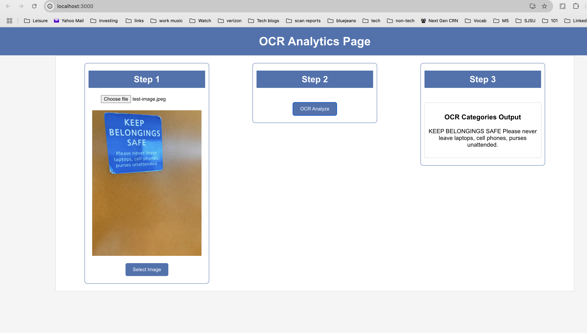

# AzureVison-OCR


## Project Overview
OCR Insights is a web-based React application that allows users to upload images and extract text from them using Azure's OCR API. This project demonstrates how to build an image-upload interface, process the image, and extract text data using Azure's Cognitive Services.



---

## Features
- Upload image files and analyze them for text content
- Use Azure OCR API for text recognition
- Display extracted text categories in a user-friendly interface

---

## Technologies Used
- **React**: For the frontend application
- **Azure OCR API**: For optical character recognition and text extraction
- **JavaScript/HTML/CSS**: Core web technologies used in the project

---

---

## How to Use the Application
1. Clone the repository:
   ```bash
   git clone https://github.com/your-username/ocr-insights.git
   cd ocr-insights

2. Install the necessary dependencies:
npm install

3. Start the application:
npm start

4. Open the application in your browser at http://localhost:3000/.

## Steps to Configure Azure OCR API
To use the OCR functionality, follow these steps:

### Create an account on Microsoft Azure.
### Go to the Azure Portal and create a new Cognitive Services resource for the OCR API.
### Get your subscription key and endpoint URL from the Azure dashboard.
### Store the key and endpoint URL in your project’s .env file:

- REACT_APP_AZURE_OCR_KEY=your-azure-key
- REACT_APP_AZURE_OCR_ENDPOINT=your-azure-endpoint

## Future Improvements
Improve error handling for API calls
Add support for multiple file formats
Enhance the UI with better styling


## Contributing
Contributions are welcome! Please follow the typical Git workflow:

Fork the repository
Create a new branch (git checkout -b feature/my-feature)
Commit your changes (git commit -am 'Add my feature')
Push to the branch (git push origin feature/my-feature)
Create a new Pull Request
